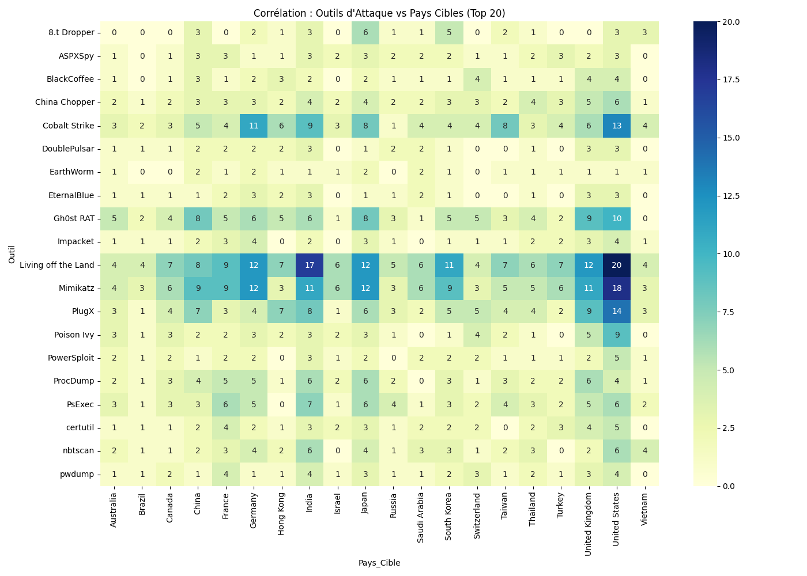
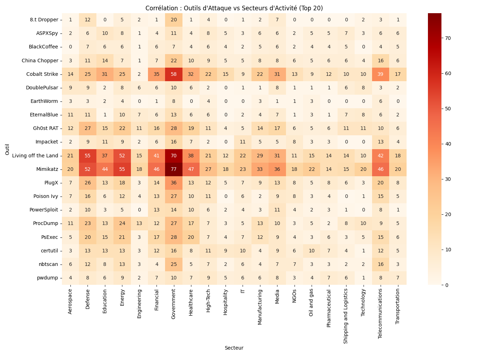

<div align="center">

# 🛡️ CYBERIA


Pipeline CTI qui agrège, nettoie et enrichit des données sur **919 acteurs cybercriminels**,  
les corrèle avec des indicateurs géopolitiques (GMI, PIB, régime politique) et les analyse via MITRE ATT&CK.

**Projet TER — ESIEA × UVSQ-CESDIP**

</div>

---

## ⚙️ Installation

```bash
git clone https://github.com/ton-user/cyberia.git
cd cyberia
pip install -r requirements.txt
mkdir -p html resultat
```

---

## 🔄 Pipeline de nettoyage & enrichissement

**Script :** `Data_Cleaning_Pipeline.py` → produit `threat-actor-cleaned.json`

### 1. Chargement & fusion des sources

```
threat-actor.json  ──┐
tgc-actors.json    ──┼──► merge par nom d'acteur
tgc-tools.json     ──┘
```

Chaque acteur de `threat-actor.json` est matché contre les entrées `tgc-actors.json` (nom principal + synonymes) via **fuzzy matching à seuil 95%** — d'abord un match exact (après normalisation), puis `fuzz.ratio` / `partial_ratio` / `token_set_ratio` si aucun exact n'est trouvé. Les outils et techniques MITRE sont ensuite rattachés aux acteurs via les relations `used-by` (UUID) dans `tgc-tools.json`, sans fuzzy.

### 2. Normalisation des champs CTI

| Champ | Traitement |
|-------|-----------|
| `cfr-suspected-state-sponsor` | Mapping manuel des variantes longues (`"People's Republic of China"` → `"China"`) |
| `country` | Normalisation en majuscules (ISO-2) |
| `mitre_techniques` | Extraction par regex `(T\d{4}|S\d{4}|G\d{4})` depuis les URLs de refs + déduplication |
| `cti_tools` | Récupération directe depuis `tgc-tools.json` via UUID, déduplication |
| `year_created` | Extraction par regex `\d{4}` sur le champ `created`, fallback MISP |

### 3. Enrichissement géopolitique

Pour chaque acteur, le code ISO-2 du pays (`country`) est converti en ISO-3 via une table de correspondance manuelle, puis jointé sur trois sources externes :

**PIB par habitant** — [Our World in Data / Banque Mondiale](https://ourworldindata.org/grapher/gdp-per-capita-worldbank)
Mesure la richesse économique du pays sponsor. Permet de corréler capacité financière et sophistication des attaques. La valeur la plus récente disponible par pays est retenue.
```
gdp.csv  →  attacker_gdp  (USD courants, dernière année disponible)
```

**Global Militarization Index 2023** — [BICC via StatBase](https://statbase.org/datasets/military/global-militarisation-index/)
Score composite (0–1000) mesurant le degré de militarisation d'un État : dépenses militaires en % du PIB et du budget santé, effectifs militaires en % de la population. Plus le score est élevé, plus l'État priorise sa capacité militaire.
```
gmi-2023.csv  →  gmi_score (0–1000),  gmi_rank
```

**Régime politique** — [Our World in Data / V-Dem](https://ourworldindata.org/grapher/political-regime)
Classification des régimes selon l'indice V-Dem, encodée sur une échelle ordinale. Permet de distinguer les acteurs étatiques selon leur contexte politique.
```
political-regime.csv  →  political_regime_label,  political_regime_code
                          0 = Closed Autocracy
                          1 = Electoral Autocracy
                          2 = Electoral Democracy
                          3 = Liberal Democracy
```

### 4. Enrichissement externe (MITRE + MISP)

Appel à l'API MITRE ATT&CK pour résoudre les IDs en noms lisibles (`mitre_techniques_resolved`). Appel à MISP Galaxy pour récupérer `first_seen`, `last_seen` et corriger les `year_created` restés `Unknown`.

### 5. Output

```json
{
  "value": "APT28",
  "year_created": 2008,
  "meta": {
    "cfr-suspected-state-sponsor": "Russia",
    "cti_tools": ["Mimikatz", "X-Agent"],
    "mitre_techniques": ["T1059", "T1078", "T1566"],
    "cti_targets": ["Government", "Defense"],
    "cti_motivation": ["Information theft and espionage"],
    "gmi_score": 843.2,
    "gmi_rank": 2,
    "attacker_gdp": 1862000000000,
    "political_regime_label": "Electoral Autocracy",
    "political_regime_code": 1
  }
}
```

---

## 📊 Analyses & Visualisations

### Heatmaps tactiques — `analyse.py`

Corrélation outils × pays cibles et outils × secteurs. Le paramètre `n` contrôle le Top affiché.




---

### Visualisations 3D — `MCT.py` / `RFC.py` / `RMC.py`

| Script | Axes | Output |
|--------|------|--------|
| `MCT.py` | Motivation / Nb cibles / Année | `html/motivation_signature_3d.html` |
| `RFC.py` | Régime politique / Score GMI / Techniques MITRE | `html/visualization_3d.html` |
| `RMC.py` | PIB / Score GMI / Complexité cyber | *(affichage direct)* |

---

## 🗄️ Import Neo4j — `import_neo4j.py`

```bash
python import_neo4j.py
# 919 acteurs importés en ~X secondes
```

**Modèle de graphe :**

```
(Actor)-[:SPONSORED_BY]──►(Country)
(Actor)-[:USES_TOOL]────►(Tool)
(Actor)-[:EMPLOYS]──────►(Technique)
(Actor)-[:TARGETS]──────►(Target)
(Actor)-[:HAS_MOTIVATION]►(Motivation)
(Actor)-[:CREATED_IN]───►(Year)
```

Chaque nœud `Country` embarque directement `gmi_score`, `gmi_rank`, `gdp` et `political_regime_label` pour les requêtes analytiques.

---

<div align="center">
CYBERIA — TER 2025 | ESIEA × UVSQ-CESDIP | Google.org Cybersecurity Seminars
</div>
